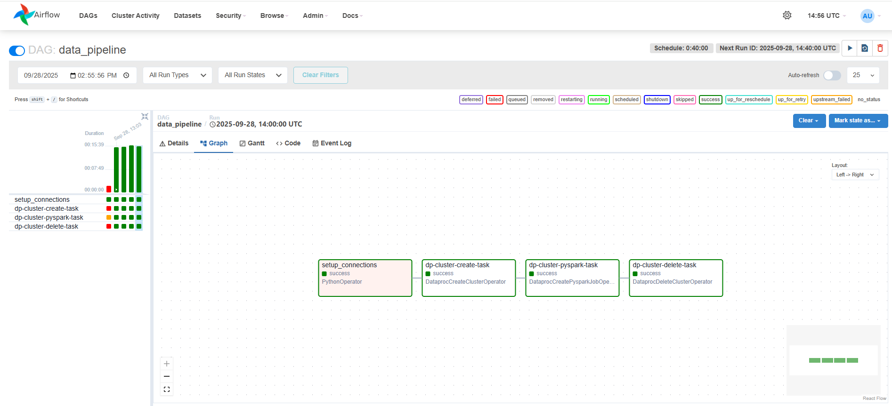
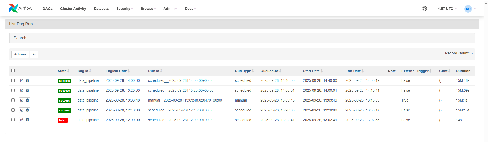
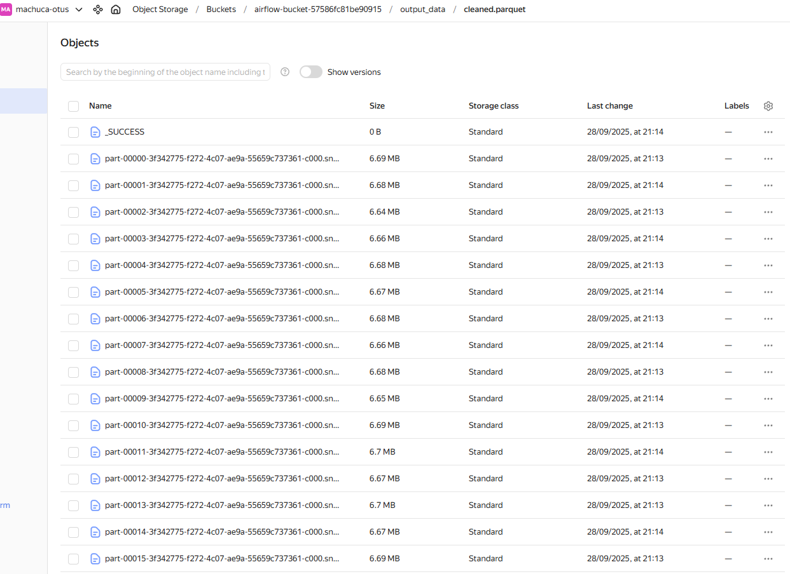

# Периодический запуск процедуры очистки датасета мошеннических финансовых транзакций

## Домашнее задание №5

## 1. Запустить систему Apache Airflow в сервисе Yandex Cloud Managed Service for Apache Airflow.

The infrastructure is set up with Apache Airflow and object storage. The DAG scripts come from the recently created object storage and the .txt data come from the previously created object storage (homework 2 and 3). For billing optimization, the DAGs are scheduled to run every 40 minutes. Each DAG creates a Spark session to process the data by reading the .txt files, cleaning the data, and saving the results in Parquet format.

## 2.  Создать DAG для ежедневного автоматизированного создания и удаления Spark-кластера и запуска скрипта очистки датасета и разместить его в директории для DAG'ов, доступной Apache Airflow. Для этого можно удобно использовать S3 bucket. В графе следует прописать этапы копирования скрипта и необходимых ему файлов на Spark-кластер, а также его запуска на кластере посредством spark-submit.

https://github.com/CristianMachucaMendoza/pipeline-airflow/blob/main/dags/data_pipeline.py
https://github.com/CristianMachucaMendoza/pipeline-airflow/blob/main/src/pyspark_script.py

## 3. Убедиться, что граф загрузился в систему и отображается в графическом интерфейсе. Файл(-ы) с DAG необходимо разместить в Вашем GitHub-репозитории и предоставить для проверки.

https://github.com/CristianMachucaMendoza/pipeline-airflow/blob/main/dags/data_pipeline.py
https://github.com/CristianMachucaMendoza/pipeline-airflow/blob/main/src/pyspark_script.py

## 4. Разрешить периодическое исполнение разработанного DAG в Apache AirFlow и протестировать его работоспособность. Требуется дождаться не менее трёх успешных запусков процедуры очистки датасета по расписанию. Снимок экрана, подтверждающий успешную работу системы, необходимо привести в README-файле Вашего GitHub-репозитория.

Scheduler success (Первый запуск не удался из-за ошибки в архитектуре инфраструктуры, но после исправления всё прошло гладко):

Results: Data cleaned
