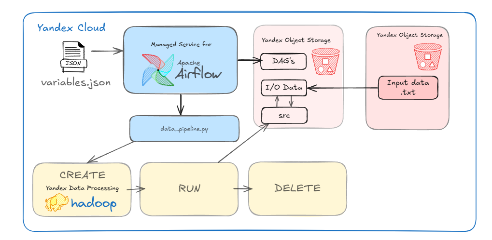

# Периодический запуск процедуры очистки датасета мошеннических финансовых транзакций

## Домашнее задание №5

## 1. Запустить систему Apache Airflow в сервисе Yandex Cloud Managed Service for Apache Airflow.

2. Посмотрим на конфигурацию инфраструктуры в модулях Terraform
3. Разберем DAG-пайплайн с Airflow и исходный код
4. Посмотрим на все компоненты в рабочем режиме
5. Запустим пайплайн и посмотрим на результаты
6. *Бонус
